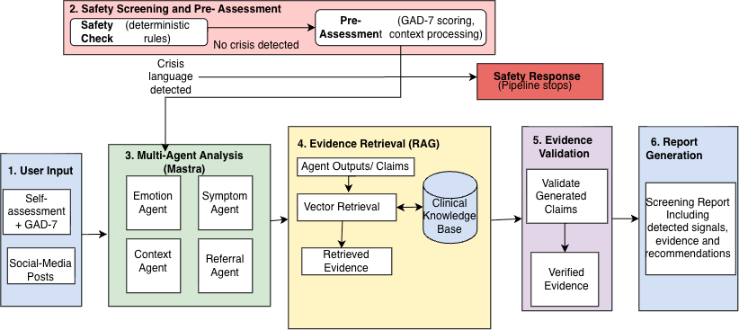

# AnxioSense

**A Multi-Agent LLM and Retrieval-Augmented Generation Framework for Anxiety Screening Support**

AnxioSense is an undergraduate research project developed at York University as part of EECS 4080.

The project explores how large language models (LLMs), multi-agent systems, and retrieval-augmented generation (RAG) can be used to support the analysis of anxiety-related information in text.

> **Important:** AnxioSense is a research prototype. It is not a diagnostic tool, a crisis service, or a replacement for a qualified healthcare professional.

---

## What is AnxioSense?

AnxioSense allows a user to provide written text, such as a journal entry or social-media text, for structured analysis.

In self-assessment mode, the system can also use responses from the **GAD-7**, a standardized anxiety screening questionnaire.

Instead of relying on a single LLM response, AnxioSense separates the analysis into several specialized components. Different agents examine emotions, symptoms, contextual stressors, and referral-related information.

The system then retrieves relevant information from a curated knowledge base and uses that evidence when producing the final screening-support report.

The goal is to make the process more structured, transparent, and evidence-grounded than simply sending the user's text to a single general-purpose chatbot.

---

## System Architecture

The overall AnxioSense workflow is shown below.



At a high level, the system follows this process:

**User Input → Safety Screening → Pre-Assessment → Multi-Agent Analysis → Evidence Retrieval → Validation → Report Generation**

### 1. User Input

The user provides text for analysis. In self-assessment mode, this may also include GAD-7 responses and information about functional impairment.

### 2. Safety Screening

Before the normal LLM pipeline runs, the input passes through a deterministic safety check.

If crisis-related language is detected, the normal report pipeline is stopped and the system provides a safety-focused response instead.

### 3. Multi-Agent Analysis

For non-crisis input, specialized agents analyze different aspects of the text:

- **Emotion Agent** — identifies emotional signals.
- **Symptom Agent** — identifies anxiety-related symptoms and indicators.
- **Context Agent** — examines stressors and contextual factors.
- **Referral Agent** — analyzes information relevant to referral recommendations.

Separating these tasks allows each component to focus on a specific part of the analysis.

### 4. Retrieval-Augmented Generation

The outputs of the agents are converted into claims.

AnxioSense then searches a curated knowledge base for evidence relevant to those claims. This is the retrieval-augmented generation (RAG) component of the system.

### 5. Validation

Retrieved evidence and generated claims are checked before the final report is produced.

This separates evidence validation from report generation rather than treating the initial LLM output as automatically correct.

### 6. Report Generation

The validated information is combined into the final screening-support report presented to the user.

---

## Research Evaluation

Alongside development of the AnxioSense application, I conducted an experimental evaluation of several open-weight large language models.

The evaluation compared five models:

- Gemma 4 31B IT
- Llama 4 Scout
- Mistral Small 4
- Phi-4
- Qwen 3.5 27B

Three prompting strategies were evaluated:

- Zero-shot
- Zero-shot Chain-of-Thought
- One-shot Chain-of-Thought

The experiments used two datasets:

- **Dreaddit** — binary distress classification
- **GoEmotions subset** — five-class emotion classification

Each model and prompting-strategy configuration was evaluated across five runs.

---

## Research Questions

The experimental portion of the project investigates three main questions.

### RQ1 — Model Performance

How does classification performance differ between the evaluated large language models?

### RQ2 — Reliability and Failure Behaviour

How reliably do the models produce valid and usable outputs across repeated runs?

### RQ3 — Prompting Strategy

How does prompting strategy affect model classification performance?

The detailed results and statistical analyses are available in:

**[Experimental Results and Analysis](results/README.md)**

---

## Repository Structure

The main parts of this repository are:

```text
anxiosense-replication/
│
├── src/                 # AnxioSense / Mastra pipeline
├── server/              # Backend API
├── frontend/            # React frontend
├── prompts/             # LLM agent prompts
├── knowledge-base/      # Knowledge used for RAG
│
├── evaluation/          # Evaluation infrastructure
├── experiment/          # Experiment-related artifacts
├── results/             # Final results and statistical analyses
│
├── docs/
│   ├── architecture/    # Architecture diagrams
│   └── reports/         # Research reports and documentation
│
├── README.md            # Project overview
├── REPLICATION.md       # Experiment reproduction instructions
└── PROVENANCE.md        # Experiment provenance information
```

## Experimental Results

The `results/` directory contains the main research outputs, including:

- descriptive results
- research-question analyses
- statistical comparisons
- confidence intervals
- invalid-output analysis
- validation artifacts
- reproducibility checks

For a detailed overview of the experimental evaluation and results, see:

**[Experimental Results README](results/README.md)**

---

## Reproducing the Evaluation

Instructions for reproducing the experimental evaluation are provided in:

**[REPLICATION.md](REPLICATION.md)**

The repository includes experiment configurations, analysis scripts, dataset manifests, provenance information, checksums, and validation artifacts used to document the experimental process.

---

## Technology

AnxioSense was developed using:

- TypeScript
- Node.js
- React
- Express
- Mastra
- Large Language Model APIs
- Retrieval-Augmented Generation (RAG)
- Vector-based information retrieval
- Python for experimental analysis

---

## Research Documentation

Research reports, architecture diagrams, and other project documentation are stored in:

```text
docs/
```
Detailed experimental results and analyses are stored in:

[`results/`](results/)

The experimental replication instructions are available in:

[`REPLICATION.md`](REPLICATION.md)

This structure keeps the system implementation, research documentation, and experimental artifacts organized within the same repository.

---

## Scope and Limitations

AnxioSense is a research prototype and should not be interpreted as a clinically validated diagnostic system.

The system does not diagnose anxiety disorders and should not be used to make autonomous clinical decisions.

The experimental findings are specific to the models, datasets, prompting strategies, providers, and experimental conditions evaluated in this project. The findings should not automatically be generalized to other models, datasets, or populations.

---

## AI-Assisted Development Disclosure

Generative AI tools were used during the development of this research prototype as programming and debugging support.

AI assistance was used for tasks including:

- debugging code and interpreting error messages
- suggesting code implementations and refactoring approaches
- assisting with test and validation scripts
- explaining programming and statistical concepts
- reviewing documentation for clarity and organization

AI-generated suggestions were not treated as automatically correct. Code, experimental procedures, outputs, and analyses were reviewed, tested, and validated before being incorporated into the project.

The research design, experimental decisions, interpretation of results, and final responsibility for the work remain with the author.

---

## Responsible Use

Because AnxioSense processes mental-health-related information, its outputs should be treated as screening-support information only.

AnxioSense is **not**:

- a medical diagnosis system
- a replacement for a physician or mental-health professional
- a crisis service
- a system for making autonomous treatment decisions

---

## Author

**Aya El-Dassouki**  
BSc Computer Science  
York University

Developed as part of the EECS 4080 undergraduate research project.

---

## Citation

If referencing this project:

> Dassouki, A. (2026). *AnxioSense: A Multi-Agent Retrieval-Augmented Framework for Anxiety Screening Support*. EECS 4080 Undergraduate Research Project, York University.
